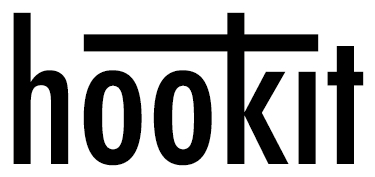

hook it or not — git hook manager.

`hookit` manages your git hooks for reusability between repositories. It extends git hooks such that multiple hooks of the same type can be executed.

It also keeps all your hooks at a common place, usually `~/.hookit`, and just links them where ever needed.

All this is done with the `git hook` command.

### Install

The easiest way to install `hookit` is with [Homebrew](http://brew.sh):
```
brew tap neonnoon/brew https://github.com/neonnoon/brew
brew install hookit
```

### Usage

Now this doesn't do much yet. You'll need a set of hooks, for example, [anylint](https://github.com/neonnoon/anylint). They are installed like so:
```
git hook install https://github.com/neonnoon/anylint
```

That makes all its hooks available:
```
git hook find
```

Hooks can then be added to a repository, e.g.:
```
git hook add anylint/pre-commit/eslint
```
